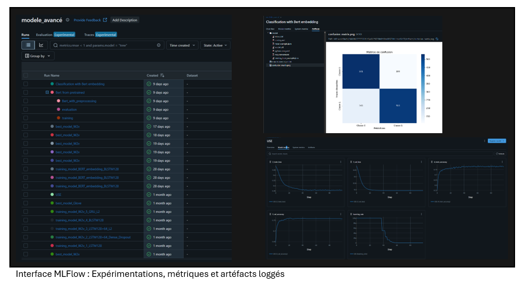

# La mission et le contexte

## Le sujet : Analyse de sentiments

Un client dans le domain du transport aérien nous a demandé un prototype fonctionnel d'un modèle permettant de détecter les tweets à connotation négative. Cette problématique liée à la modélisation du langage (Natural Language Processing ou NLP) est déjà largement étudiée. On trouve pour y répondre un arsenal de bibliothèques, de modèles spécifiquement entrainés, voire de services entièrement packagés. 
J'ai testé différentes approches avec un objectif focalisé autant sur l'exactitude de prédiction (l'accuracy) que sur le temps d'entrainement et le temps de réponse du modèle une fois déployé. 
Ce cas d'étude est également l'occasion de donner un exemple concret de la mise en application de MLOPS

## Les outils : Bibliothèques d'analyse, méthodes de modélisation du langage

Afin de pouvoir mener un calcul de classification il nous faut transformer le texte en chiffres, ou plutôt en vecteurs.
De façon intuitive on imagine qu'en associant une connotation plus ou moins négative à chaque mot on peut arriver à donner un score à une phrase. 
Les méthodes utilisées avant le machine learning, basées sur des dictionnaires associant chaque mot à un score sont encore utilisées. J'ai pu tester SentimentIntensityAnalysis (NLTK) et TextBlob. 
De façon plus élaborée on peut représenter chaque mot unique (token) par un vecteur dont les composantes sont ses occurences dans les différents tweets (comptage simple) ou encore le rapport entre sa fréquence dans un tweet et celle dans l'ensemble des tweets de l'échantillon (méthode TFIdF). Les modélisation utilisées sont CountVectorizer et TFIdF. 
Viennent ensuite des méthodes plus élaborées nécessitant la mise en oeuvre de réseaux de neurones: pour réaliser la modélisation des mots on va considérer leur contexte (les mots précédents et suivants), selon une certaine fenêtre et certaines conditions d'apparition, et les modèles les plus récents permettent de donner plus d'importance à certaines associations de mots (mécanisme d'attention). J'ai exploré successivement Word2Vec, GloVE, USE, Bert et une variation Roberta spécialisée dans l'analyse de tweet.  

## La méhtode : MLOPS

A l'instar de DeOps, MLOps est le trait d'union entre les développeurs et l'opérationnel, intégrant en plus la boucle de Machine Learning. Les étapes sont clairement définies mais quel est l'enjeu et qu'est-ce que cela implique?

### Principes de MLOPS

1 - Automatisation
Au départ, le processus de mise en œuvre d'un modèle est manuel et itératif, incluant la préparation, validation des données, et la création de modèles. 
Une fois automatisé, le modèle se forme et se recycle de manière continue, en validant les nouvelles données dès leur disponibilité. 
L'automatisation du pipeline CI/CD permet d'intégrer et de déployer des modèles ML de manière continue et sans intervention manuelle.

2 - Intégration continue
L'intégration continue permet de valider les tests, les données, les schémas et les modèles, tout en déployant automatiquement des pipelines ML ou en annulant les modifications non désirées.

3 - Reproductibilité
Stockage de la conception, du traitement des données, de la formation du moèdle, du déploiement afin que les modèles soient facilement reproduits.

### Avantages de MLOPS

- L'automatisation des processus permet le déploiement rapide d'un grand nombre de modèles
- Productivité améliorée grâce à la collaboration et à la réutilisation des modèles
- Les modèles non déployés peuvent être valorisés 
- Les modèles peuvent être surveillés et actualisés 
- Plus de réussite dans les projets grâce à l'intégration, au déploiement, à la livraison, la surveillance et les tests continus des modèles

### Outils choisis
- Pipeline de données: Automatisé dans un notebook 

- Pipeline ML: MLFlow utilisé à la fois pour l'enregistrement des expérimentation et des résultats et pour le registre de modèles. 
- Pipeline d'application: Avec un dossier de travail configuré comme dépôt local Git, Visual Studio Code possède l'ensemble des extensions permettant de visualiser les modifications du code et de gérer le versionning, puis dans les étapes de développement de réaliser les tests. 

# Étape 1 : Analyse et préparation des données

## Sélection du jeu de données

## Analysis et visualisation

## Nettoyage

## Feature engineering

## Pre-traitement

# Étape 2 : Modélisation

## Approche classique 

## Modèle avancé

## Modèle avancé sur mesure

# Étape 3 : Déploiement

## Plan de déploiement

## Interface de tests locale

## Pipeline de déploiement continu

## API déployée

# Étape 4 : Suivi et amélioration

## Performance et incidents

## Détection de prévisions incorrectes

## Mécanisme d'amélioration continue

