# La mission et le contexte

## Le sujet : Analyse de sentiments

Un client dans le domaine du transport aérien nous a demandé un prototype fonctionnel d'un modèle permettant de détecter les tweets à connotation négative. Cette problématique liée à la modélisation du langage (Natural Language Processing ou NLP) est déjà largement étudiée. On trouve pour y répondre un arsenal de bibliothèques, de modèles spécifiquement entrainés, voire de services entièrement packagés. 
J'ai testé différentes approches avec un objectif focalisé autant sur l'exactitude de prédiction (l'accuracy) que sur le temps d'entrainement et le temps de réponse du modèle une fois déployé. 
L'objectif de cet article est d'illustrer comment MLOPS nous aide dans une démarche d'élaboration et de mise en production d'un modèle. Je n'ai pas détaillé le travail de conception Machine Learning/Deep Learning dans dans le cadre du NPL (Language Natural Processing) mais il y a j'espère suffisament d'encarts d'information pour que les non spécialistes s'y retrouvent 😜.

## Les outils : Bibliothèques d'analyse, méthodes de modélisation du langage

Afin de pouvoir mener un calcul de classification il nous faut transformer le texte en chiffres, ou plutôt en vecteurs. De façon intuitive on imagine qu'en associant une connotation plus ou moins négative à chaque mot on peut arriver à donner un score à une phrase. 

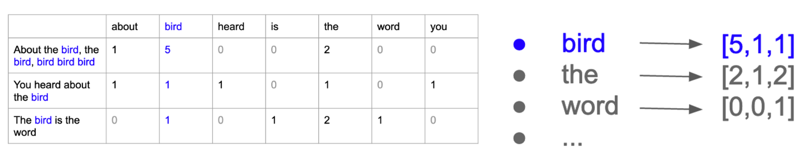
<i> Modélisation par comptage de mots </i>

    <b>
    Les méthodes utilisées avant le machine learning, basées sur des dictionnaires associant chaque mot à un score sont encore utilisées. J'ai pu tester SentimentIntensityAnalysis (NLTK) et TextBlob. 
    De façon plus élaborée on peut représenter chaque mot unique (token) par un vecteur dont les composantes sont ses occurences dans les différents tweets (comptage simple) ou encore le rapport entre sa fréquence dans un tweet et celle dans l'ensemble des tweets de l'échantillon (méthode TFIdF). Les modélisation utilisées sont CountVectorizer et TFIdF. 
    Viennent ensuite des méthodes plus élaborées nécessitant la mise en oeuvre de réseaux de neurones: pour réaliser la modélisation des mots on va considérer leur contexte (les mots précédents et suivants, les différentes phrases), selon une certaine fenêtre et certaines conditions d'apparition.Les modèles les plus récents permettent de donner plus d'importance à certaines associations de mots (mécanisme d'attention). J'ai exploré successivement Word2Vec, GloVE, USE, Bert, et une variation Roberta spécialisée dans l'analyse de tweet.  </b>

## La méhtodologie : MLOPS

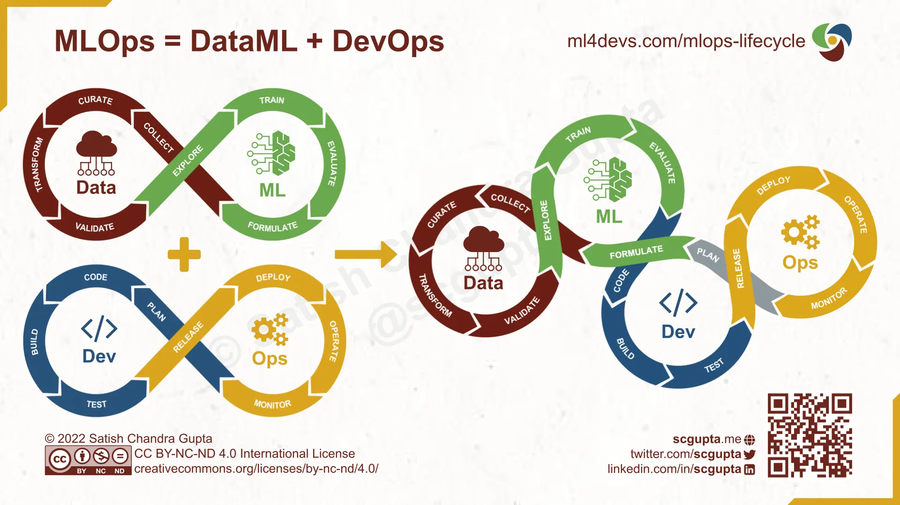
<i> Boucle sans fin du MLOPS </i>

A l'instar de DeOps, MLOps est le trait d'union entre les développeurs et l'opérationnel, intégrant en plus la boucle de Machine Learning. Les étapes sont clairement définies mais quel est l'enjeu et qu'est-ce que cela implique?

### Principes de MLOPS

1 - Automatisation
Au départ, le processus de mise en œuvre d'un modèle est manuel et itératif, incluant la préparation, la validation des données, et la création de modèles. 
Une fois automatisé, le modèle se forme et se recycle de manière continue, en validant les nouvelles données dès leur disponibilité. 
L'automatisation du pipeline CI/CD (Intégration continue/Développement continu)permet d'intégrer et de déployer des modèles ML de manière continue et sans intervention manuelle.

2 - Intégration continue
L'intégration continue permet de valider les tests, les données, les schémas et les modèles, tout en déployant automatiquement des pipelines ML ou en annulant les modifications non désirées.

3 - Reproductibilité
Stockage de la conception, du traitement des données, de la formation du moèdle, du déploiement afin que les modèles soient facilement reproduits.

### Avantages de MLOPS

- L'automatisation des processus permet le déploiement rapide d'un grand nombre de modèles
- Productivité améliorée grâce à la collaboration et à la réutilisation des modèles
- Les modèles non déployés peuvent être valorisés 
- Les modèles peuvent être surveillés et actualisés 
- Plus de réussite dans les projets grâce à l'intégration, au déploiement, à la livraison, la surveillance et les tests continus des modèles

### Outils choisis
- Pipeline de données: Automatisé dans un notebook 

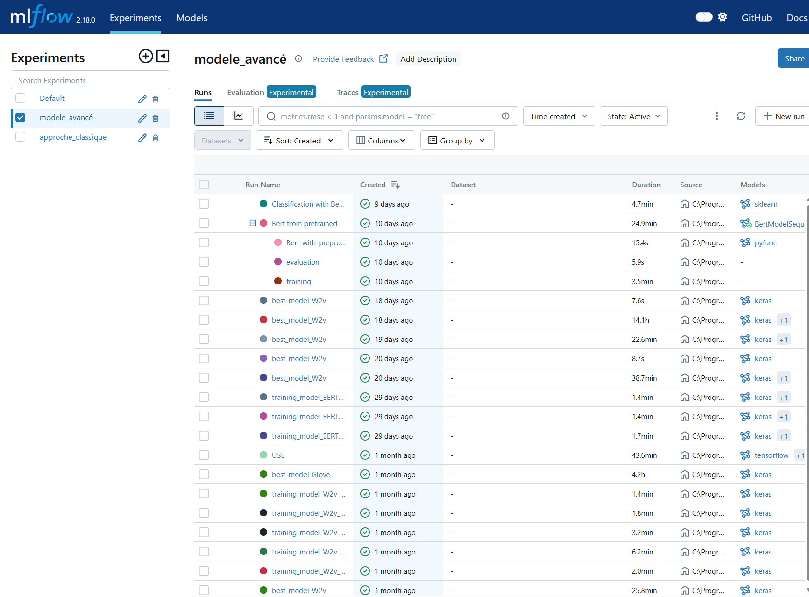
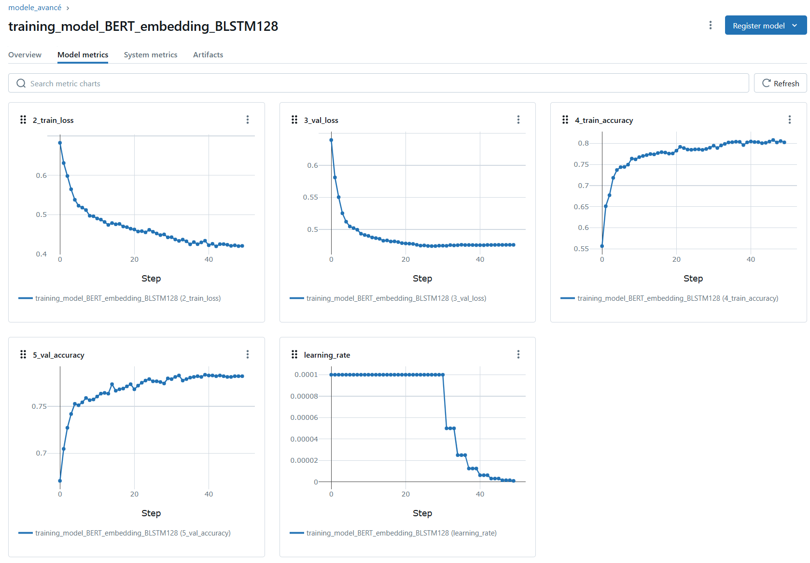
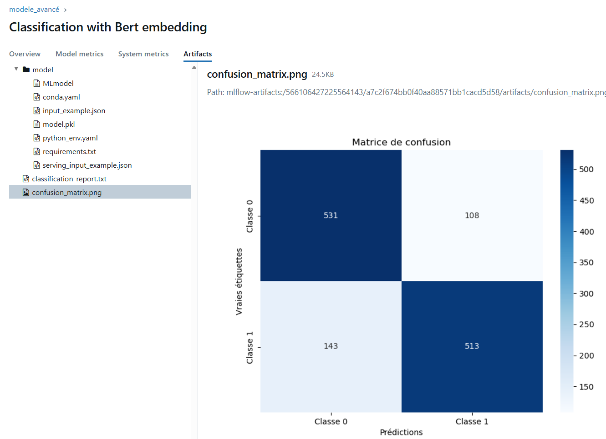
<i> Interface MLFLOW: Expérimentations, métriques et artéfacts loggés </i>

- Pipeline ML: MLFlow utilisé à la fois pour l'enregistrement des expérimentation et des résultats et pour le registre de modèles. 
- Pipeline d'application: Avec un dossier de travail configuré comme dépôt local Git, Visual Studio Code possède l'ensemble des extensions permettant de visualiser les modifications du code et de gérer le versionning, puis dans les étapes de développement de réaliser les tests. L'application est déployée via un workflow Github actions. 

# Étape 1 : Analyse et préparation des données

N'ayant pas de données client j'ai utilisé un jeu de données [Open Source](https://www.kaggle.com/datasets/kazanova/sentiment140) contenant 1 600 000 tweets étiquetés postif/négatif de façon équilibrée. 

## Sélection du jeu de données

Afin de couvrir le vocabulaire métier les tweets utilisant les termes typiques du transport aérien on été sélectionnés. J'ai ensuite appliqué LanguageDectector (Spacy) pour limiter aux tweets en langue anglaise. Après ré-équiilibrage par élimination j'ai un jeu de données de 6 473 tweets.

## Nettoyage

Il n'y a pas de valeurs manquantes par contre des doublons ont été détectés. J'ai supprimé ceux pouvant créer une confusion lors de la modélisaton: par exemple ceux ayant le même contenu textuel mais qui ont été jugés soit positif soit négatif. Il y a également les messages identiques multiples d'un même auteur (un seul a été préservé) qui peuvent biaiser les modélisations par comptage de mots.

## Pré-traitement

Cette partie est particulièrement utile pour les méthodes dont le temps de calcul et la taille des matrices résultantes dépendent de la taille du vocabulaire, typiquement les méthodes classiques par comptage.  
Les méthodes plus récentes possède des outils de prétraitement, surtout la tokenisation - réductions à des mots uniques. Il est utile de réaliser ces étapes manuellement afin de pouvoir dimensionner par exemple la taille à choisir pour l'homogénéisation des tenseurs en entrée des méthodes les plus élaborées comme WordToVec ou Bert (le padding) ou encore dimensionner la taille maximale des séquences en entrée des réseaux de neurones. 

### Traitement du "langage tweet" 

Les tweets constituent une variante du langage commun avec des expressions exacerbées (répétitions), imagées (écomticon) et l'utilisation de hashtags, d'url, de citations. Pour chaque étape il faut juger si le texte concerné peut avoir une valeur informative. Voici ce qui a été appliqué:

- Détection des expressions héritées de html générées lors du passage en texte brut (ex: &Amp)
- Remplacement des url et des citations par des balises <url> et <mention>  
        Original: was totally crushed when I found that much looked forward to plane read: Air Kisses by @zotheysay, had sold out at airport  
        Modifié: was totally crushed when I found that much looked forward to plane read: Air Kisses by <mention>, had sold out at airport
        
- Réduction de la répétition des caractères, dans cet exemple les points d'exclamation 
        Original: Sitting in the airport, waiting for the plane to arrive, so we can depart!!!   http://twitpic.com/6ebzo 
        Modifié: Sitting in the airport, waiting for the plane to arrive, so we can depart!!  <url>

- Utilisation de dictionnaires d'abbréviations, d'expression d'argot et d'emoticons pour interpréter les caractères
- Suppression des caractères spéciaux résiduels (@, #, caractères non ASCII)
- Expansion des contractions et application d'un correcteur d'orthographe (languagetoolPython)
        Original: @DavidArchie Hope you, your team, Cookie &amp; his crew have a safe trip home! You guys are all amazing! Hope you'll get some R&amp;R time now. 
        Modifié: <mention> Hope you, your team, Cookie & his crew have a safe trip home! You guys are all amazing! Hope you will get some Randy time now.
 
L'application de l'ensemble de ces fonctions sur les tweets sélectionnés est rapide grâce à l'utilisation de bibliothèques et aux expressions régulières (3'40").          

### Réduction du vocabulaire

La tokenisation des textes de tweets après les premiers traitements conduit à un vocabulaire de plus de 12 000 termes qu'il faut chercher à réduire pour réduire la taille des matrices. 
La suppression de certains signes de ponctuation non informatifs (, . ; :) et une lemmatisation (regroupement des termes ayant la même racine) permet de réduire le vocabulaire de 25%.

## Feature engineering

J'ai utilisé un encodeur étudié spécifiquement pour l'analyse de sentiments. SentimentIntensityAnalyser (SIA de NLTK) attribue un score de sentiment à une une phrase, en combinant simplement les scores de chaque mot de la phrase. Voici un example avec un tweet brut, après nettoyage, après tokenisation/lemmatisation: 

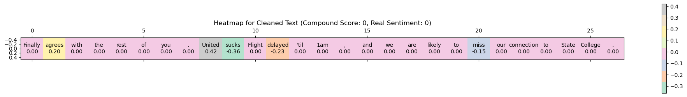
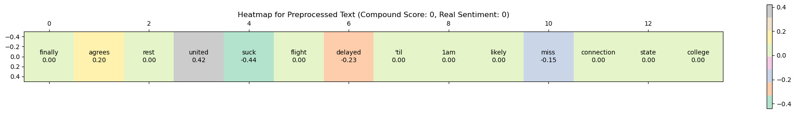

<i>Score SIA d'une phrase exemple selon l'étape de pré-traitement </i>

## Métrique adaptée à la problématique métier

Le client souhaite détecter les "bad buzz" donc les sentiments négatifs en priorité. J'ai donc défini le score de sentiment négatif (initialement 0) comme la classe positive(1) et le score de sentiment positif (initialement 4) comme la classe négative (0). 
La métrique principale sera bien sûr l'exactitude globale (accuracy) et pour des performances équivalentes il faudra examiner le rappel (recall) qui est le taux de prédiction positives correctes et donc minimise les faux négatifs.

## Baseline

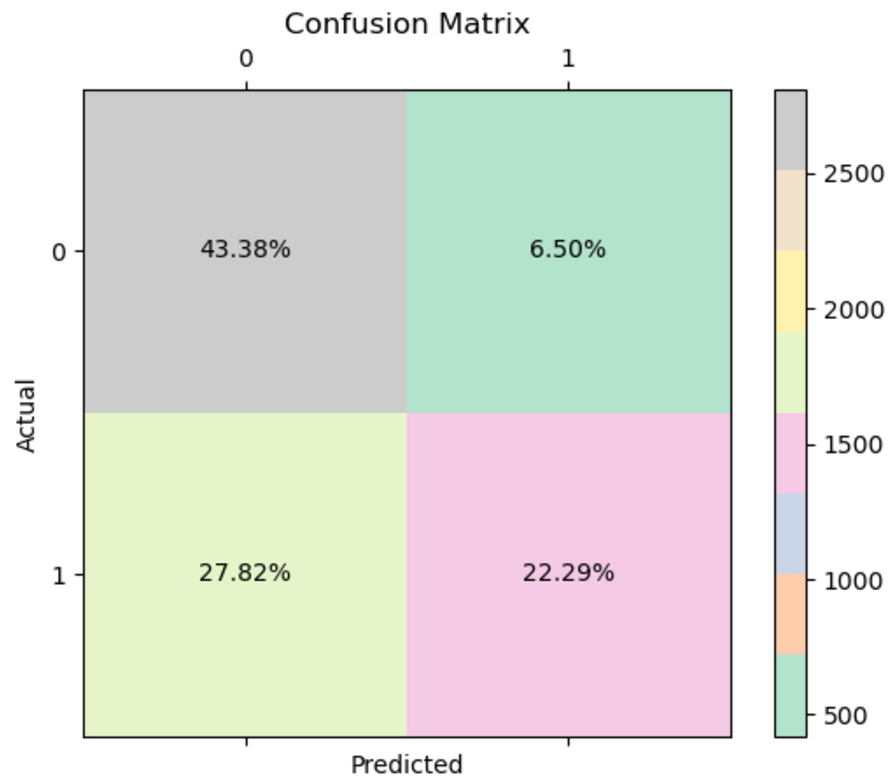
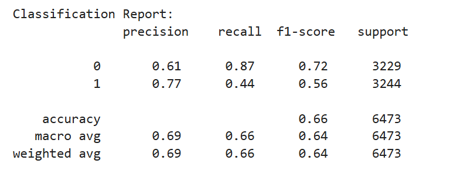 
<i> Matrice de confusion et rapport de classifcation des valeurs de score SIA vs étiquettes réelles </i>   
 
En comparant la colonne de score SIA aux étiquettes réelles on obtient une accuracy de 0,66. Par contre la matrice de confusion montre que la classe 1 (sentiment négatif) est moins bien prédite que la classe 0. 
 

# Étape 2 : Modélisation

## Approche classique

### API sur étagère
En première approche j'ai testé le service [Azure AI Language](https://azure.microsoft.com/en-us/products/ai-services/ai-language?msockid=366d561faaeb6ac416084323ab526ba8). La performance est tout juste supérieure à la baseline, avec également une disparité entre les classes. Bien que la documentation du service ne fournisse pas de détail, les modèles utilisés sont basés sur Bert avec des prétraitements. Cela nous prouve que le problème n'est pas trivial ! 😣

### Optimisation automatique 

#### AutoML (sans GPU -> pas de deep learning)

Azure fournit également un service d'optimisation automatique à partir des données textes vers une classification. Le modèle le plus performant est un ensemble constitué de différentes régressions logistiques et de SVM appliqué sur une modélisation du texte par TfIdF. L'exactituce atteinte est de 0,75.  
 
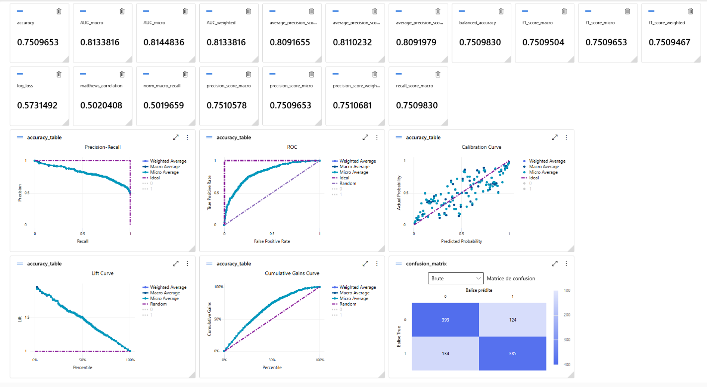 
<i> Métriques du meilleur modèle AutoML </i>
 
 
Il est possible de sauvegarder le modèle et le code python utilisé pour sa mise au point, par contre l'environnement nécessaire est complexe et très dépendant de Azure. Néanmoins cet expérimentation nous montre la voie vers le type d'embedding et d'algorithme les plus adaptés à notre problème.

#### Pycaret (on peut utiliser aussi AutoSKLearn)

Pycaret permet d'explorer rapidement un ensemble complet d'algorithmes de classification à partir de jeux de données avec séparation train/test.Il possède une fonctionnalité de log automatique dans MLFlow ainsi que l'ensemble des étapes de mise au point d'un modèle à l'aide de commandes simples. 

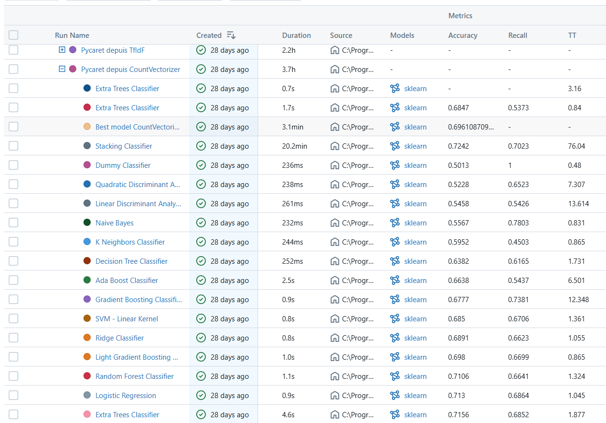
<i> Suivi d'expérimentation MLFlow des algorithmes de classification testés par Pycaret depuis un embedding CountVectorizer du texte prétraité </i> 

Le modèle de stacking combinant Extra Trees, SVM et Régression logistique a les meilleures performances par contre son entrainement 75 fois plus long que les modèles simples comme la régression logistique ; il risque d'être peu réactif en production. 
Au final la régression logistique apparait une fois de plus comme une solution intéressante. Une représentation en projection NCA montre que pour ce classifieur les erreurs sont situées à la frontière entre les classes et non pas aléatoirement réparties 

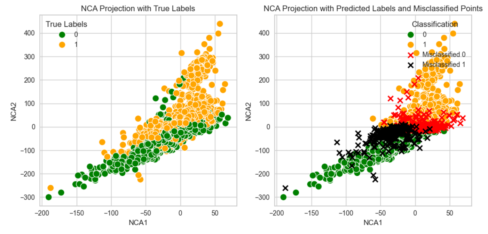 
<i>Projection NCA d'une classification par régression logistique </i>

#### Optimisation de la régression logistique

Soyons imaginatif: la régression logistique est plutôt efficace et nous avons par ailleurs l'information de score de sentiment. 
Quelques essais de paramètres de la régression logistique et le pipeline est prêt. Même en utilisant la colonne de texte sans pré-traitement les performances sont presque aussi bonnes sur l'échantillon de test que AutoML et un recall de 0,76 sur la classe 1, plutôt bien prédite. 

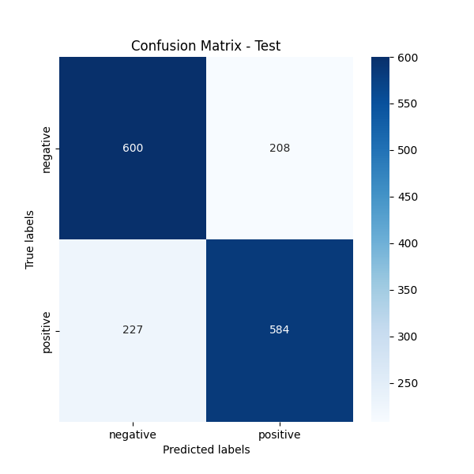
 
<i>Matrice de confusion et rapport de classification du modèle combinant régression logistique et SIA </i>

### Enregistrement d'un modèle

Le registre de modèles de MLFlow permet de pouvoir utiliser le modèle lors de phases ultérieures de déploiement. En enregistrant le modèle avec une signature et un schéma de données d'entrée et de sortie il sera bien documenté et prêt à l'emploi grâce aux fonctions de chargement de la bibliothèque mlflow.

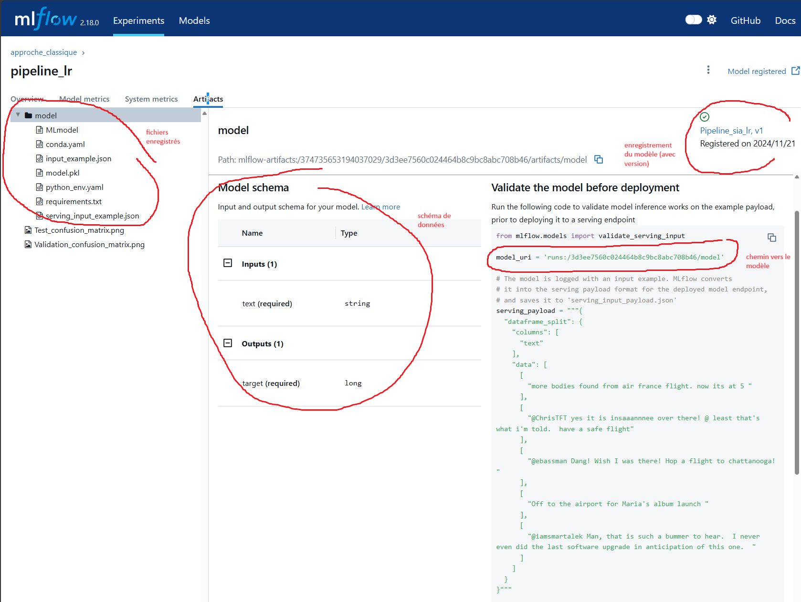
<i> Modèle complet enregistré dans MLFlow </i>  

Comme le serveur MLFlow local est utilisé une copie des fichiers du modèle est enregistrée dans un conteneur de stockage en ligne afin de pouvoir être servie en production.

## Modèles avancés

    <b>
Alors que la première partie concernait des modélisations du corpus de documents par comptage de mots ou de grammes, les modèles de cette seconde partie reposent sur des modélisations de langage tenant compte du contexte des mots. Pour stocker ces données une matrice en deux dimensions n'est pas suffisante: on utilise des tenseurs, c'est-à-dire des matrices de données à dimensions multiples, cette première étape nécessite déjà des reseaux de neurones. Ensuite le modèle lui-même apporte ses traitements également par réseaux de neurones et enfin il faut ajouter une couche de sortie selon l'objectif visé, ici une classification binaire qui peut être intégrée dans le modèle ou effectué à posteriori. 
Le ré-entrainement complet des modèles n'est pas recommandé surtout avec un faible volume de données par contre on peut envisager d'extraire les embeddings aplatis en 2D (transfer learning) pour effectuer une tache de classification ou de ré-entrainer partiellement en figeant des couches. </b>

 

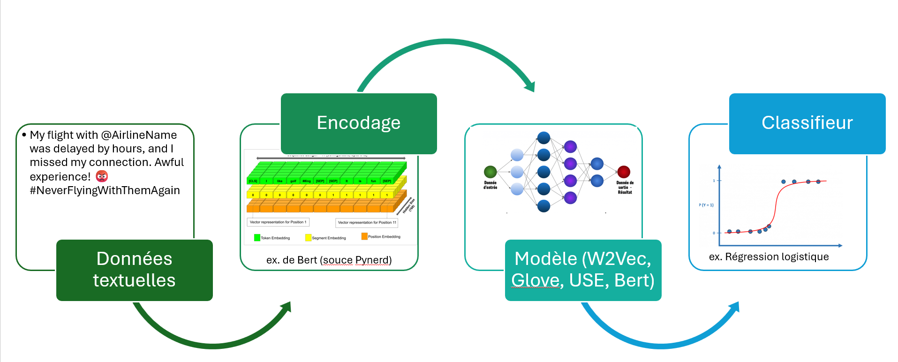
<i> Principe général des modèles avancés (deep learning) </i>

### Embedding Word2Vec

    <b>
    L'embedding de Word2Vec encode les phrases en prenant en compte pour chaque mot le contexte dans une fenêtre définie. J'ai choisi un fenêtre de 5 mots et la méthode skip-gram (prédiction d'un mot en fonction du contexte) pour effectuer un embedding en dimension 300 depuis le texte prétraité. Cet embedding se fait avec le modèle Word2Vec (Gensim) pré-entrainé sur un large corpus.  </b>

 

Une fois l'embedding réalisé j'ai testé la capacité de traitement avec un réseau de neurones mettant en oeuvre LSTM pour aboutir à une classification des phrases. Grâce à MLFlow j'ai obtenu immédiatement une comparaison des modèles: 

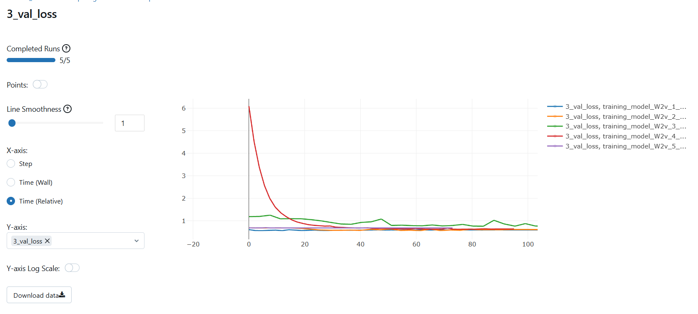
<i>Utilisation de la fonction compare de MLFlow </i> 

Malgré l'utilisation de l'ensemble des techniques réduisant le sous- et le sur-apprentissage (couches denses intermédiaires, doublement de la couche LSTM, dropout, régularisation) les résultats sont moyens. Le meilleur modèle utilise LSTM bi-directionnel, je l'ai optimisé automatiquement (structure et paramètres) grâce à Keras tuner mais les résultats sont moins bons que le modèle retenu dans l'approche classique.

## Embedding Glove

    <b>
    L'embedding Glove combine les avantages de Word2Vec (prise en compte du contexte local) et des modèles de comptage en calculant des co-occurences dans l'ensemble du corpus. De façon similaire à Word2Vec l'embedding est réalisé avec le modèle pré-entrainé et sert de couche d'embedding à un modèle sur mesure de deep learning.   </b>

  
Cet embedding a été testé avec un réseau de neurones de structure similaire à celui mis au point pour Word2Vec et optimisé avec Keras Tuner. Les résultats sont meilleur (val_accuracy 0.72 pour 0.7 avec Word2Vec).

## USE

    <b>
USE produit des représentations contextuelles qui tiennent compte de l'ensemble de la phrase, non pas seulement des mots ce qui lui permet de capturer les relations contextuelles et sémantiques. Il est très facile à mettre en oeuvre via Tensorflow Hub   </b>

  

En utilisant USE comme une boite noire et en ajustant ses poids à nos données on a immédiatement un résultat de l'ordre des meilleurs modèles de l'approche classique (accuracy_test 0.74). 

## Bert

Malgré la bonne performance de USE l'utilisation des moyens du deep learning (GPU) n'a pas vraiment amélioré ce qui avait été obtenu avec l'approche classique. Essayons une des méthodes les plus récentes.  

    <b>
BERT (Bidirectional Encoder Representations from Transformers) est conçu pour comprendre le contexte des mots de façon bi-directionnelle. Il utilise un mécanisme d'attention pour comprendre les relations entre les mots de la phrase. Le pré-entrainement inclut la prédiction de mots masqués et l'établissement de relations entre les phrases.  </b>

  
La flexibilité et la puissance de Bert nous permettent d'envisager plusieurs utilisations: 
-  Transfer learning et ajoutant une couche dense de classification entrainable au modèle pré-entrainé. 
-  Utilisation des embeddings (dernière couche cachée) comme entrée d'un classifieur 
-  Fine-tuning avec le jeu de données 

Un simple ré-entrainement depuis un modèle pré-entrainé est rapide (3'40") et amène un progrès immédiat avec une prédiction correcte à plus de 80%. 

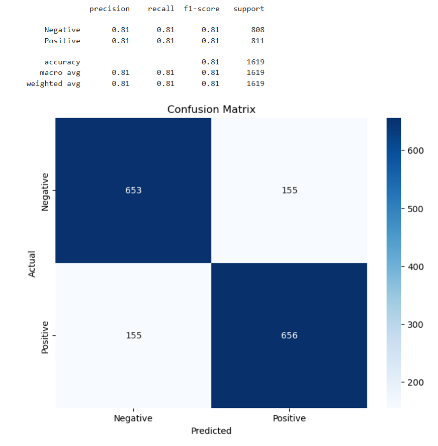 
<i>Résultat du modèle Bert pré-entrainé (jeu de test)</i>

C'est la solution qui sera retenue car différents classifieurs appliqués sur l'embedding extrait de la dernière couche cachée conduit au même résultat avec un temps de calcul plus long et le modèle fine-tuné permet de gagner 1% mais nécessite presque 2h d'entrainement.

## Roberta (modèle twitter-roberta-base-sentiment)

Avec une variante de Bert entrainé spécifiquement avec des tweet la version pré-entrainée donne un résultat banal, mais le fine-tuning de l'ordre de 80% permet de mieux prédire la classe 1 (sentiment négatif) que la classe 0. 

# Étape 3 : Déploiement

Le modèle Bert pré-entrainé n'a pas pu être déployé sur la solution choisie (Azure compte gratuit) qui octroit 1 Go de stockage ce qui n'est pas suffisant pour importer les bibliothèques nécessaires à l'exécution du modèle plus le chargement du modèle lui-même. 
J'ai donc déployé le modèle combinant la régression logistique avec SIA.

## Pipeline de déploiement continu

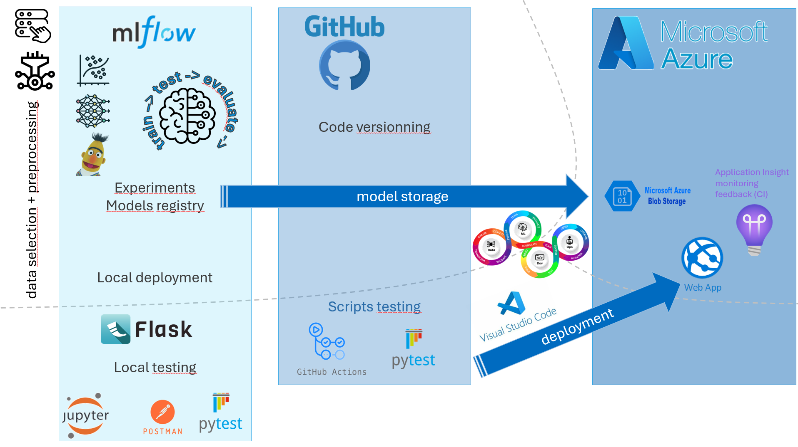

En local, une fois les tests d'accessibilité du modèle et de son fonctionnement réalisés dans l'environnement de travail, un environnement dédié a été créé pour reproduire celui en production.  
Les tests unitaires ont été effectués dans cet environnement de test puis intégrés dans le script de déploiement dans Github actions pour conditionner le déploiement à la réussite des tests. 
Dans l'environnement de production le modèle est dans un stockage monté directement dans la ressource d'exécution. Le déploiement se fait de manière automatisée depuis Github. 
Enfin une ressource Application Insight a été créée afin de capturer les événements. Grâce à l'utilisation de Opentelemetry depuis l'application cela fonctionne également depuis l'environnement local.

## Tests unitaires
Cinq groupes de tests ont été mis en place:
1. Disponibilité du modèle: Vérifie la présence du conteneur dans l'espace de stockage et la présence des fichiers nécessaires à son exécution
2. Modèle: Passe en mode test et vérifie que le modèle ne se charge pas
3. Test de l'app: en mode test instancie un mock qui simule un modèle et teste le predict de l'app.
4. Test des routes: dans le même contexte que le test précédent, vérifie les autres routes et que l'absence de texte conduit à une erreur
5. Test de logging: Génère des traces qui doivent être capturées par Azure Application Insight

💡Le passage en mode test à travers une variable d'environnement permet d'éviter de charger le modèle et de reproduire un chemin local. Cela est particulièrement utile pour les tests dans Github Actions.

## API déployée [Analyse de sentiment des tweets](https://tweetsentimentanalysiseco-fuetaqf3hbezegch.francecentral-01.azurewebsites.net/)

[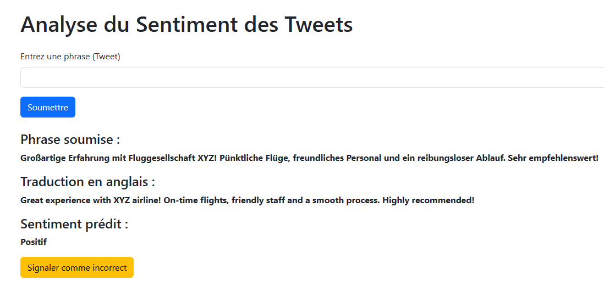]([URL/de/la/page/cible](https://tweetsentimentanalysiseco-fuetaqf3hbezegch.francecentral-01.azurewebsites.net/))

L'API utilise DeepTranslator (Google), accepte jusqu'à 500 caractères et supporte tout types de caractères. Des tests de sécurité manuels ont été menés, l'application traite les scripts comme des chaines - par contre j'ai évité de les stocker.

# Étape 4 : Suivi et amélioration

## Performance et incidents

Le modèle est particulièrement réactif avec un temps de réponse de l'ordre de 200-300 ms. Les volumes de transaction et le temps d'utilisation du CPU sont très faibles vu la légèreté du modèle et l'économie de moyens de calcul faite en ne recourant pas aux tenseurs.

## Détection de prévisions incorrectes

Une requête dans les journaux de suivi a été sauvegardée et est ré-utilisée dans une alerte qui envoie un email d'alerte dès qu'il y a plus de 5 détections de prédictions incorrectes en 5 minutes.

## Mécanisme d'amélioration continue

Avec une requête similaire on récupère une fois par semaine la table complète des prédictions incorrectes. Une accumulation au delà d'une certaine limite déclenchera le ré-entrainement du modèle avec les nouvelles données ainsi collectées. 

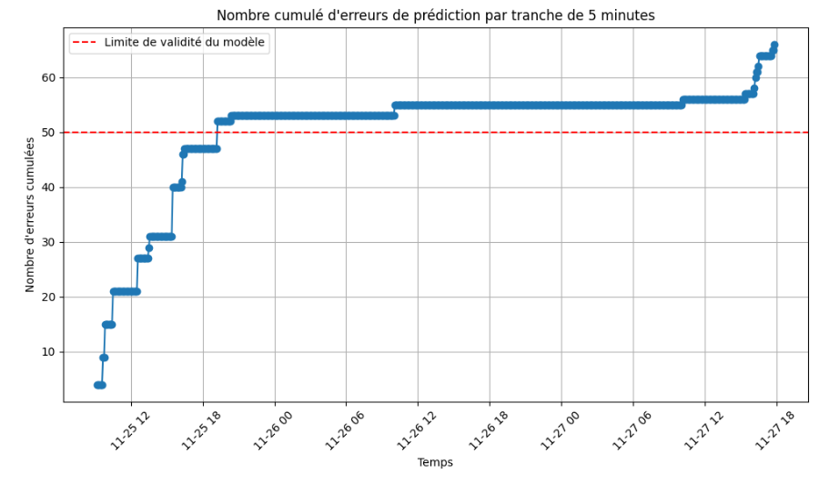 
<i>Suivi des remontées de prédictions incorrectes (cumul) </i>
 

# Conclusion: Takeouts du projet

D'un point de vue ML la leçon est claire: même si du côté du développeur certains modèles élaborés sont très performants, ils ne sont pas toujours adaptés aux exigences et au contexte de la production.  

La mise en oeuvre de MLOPS est une vraie école de rigueur au départ: 
- il faut concevoir les trackings de façon à pouvoir les comparer
- logger les modèles demande de respecter la méthodologie de MLFlow
- Github actions est puissant mais il faut savoir repenser les choses dans un environnement isolé

Quand on a passé le temps nécessaire à la mise en place de ces étapes le déploiement devient une formalité 😉